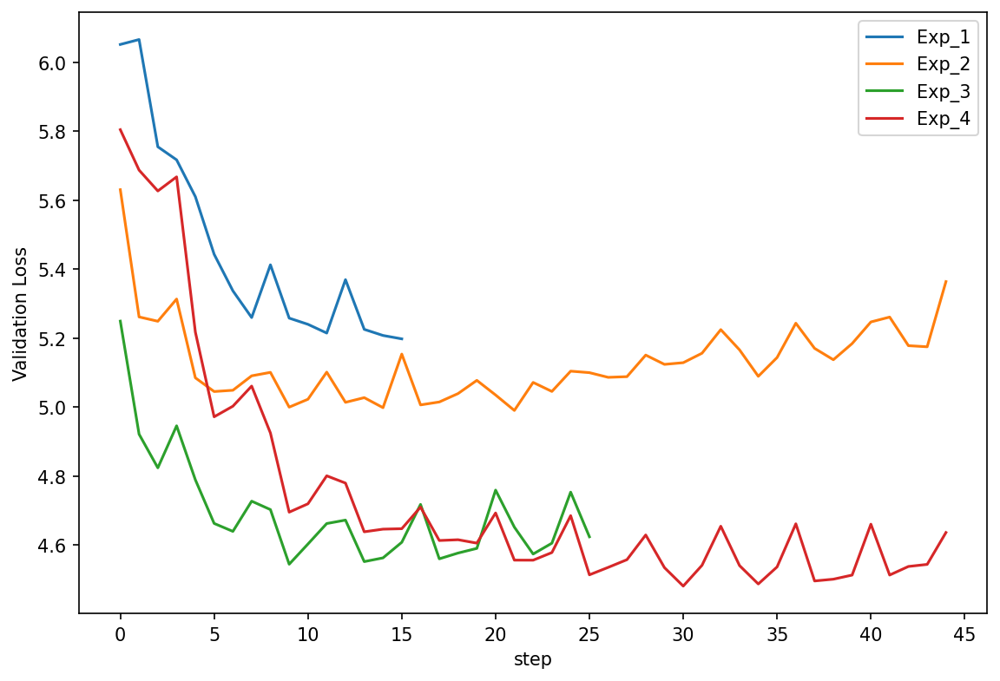
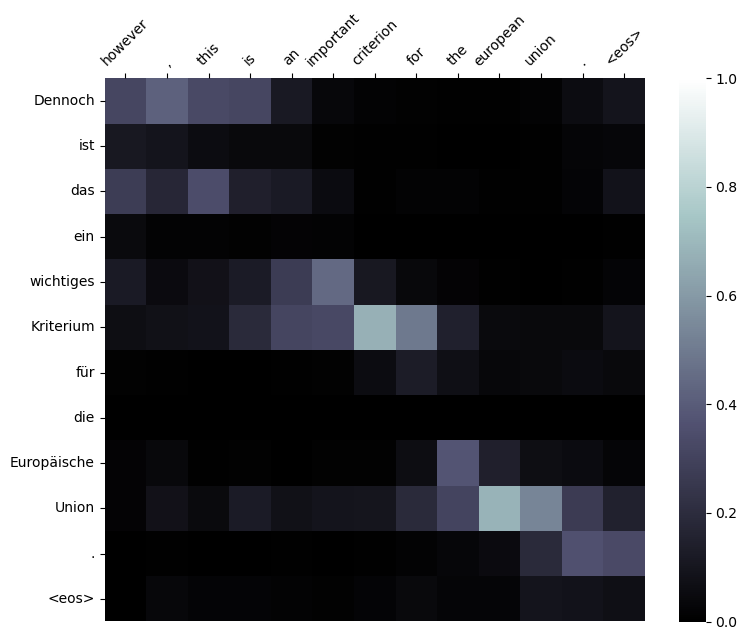

# Incorporating Attention Mechanisms in RNN-based Encoder-Decoder Models

## Overview

This repo represents the codebase for my final project in the course Text-Mining course at LiU. 

Machine translation has been a hot topic in the field of natural language processing (NLP) for many years. In recent years, the use of neural networks has revolutionized machine translation and led to the development of more accurate and efficient translation models. One of the key innovations in this field has been the introduction of the attention mechanism, which allows the model to focus on certain parts of the input sequence when generat- ing the output sequence. 

In this research project, we will investigate one of the earlier approaches to attention proposed by [Bahdanau et al. (2016)](https://arxiv.org/abs/1409.0473), which also contributed to the development of the transformer architecture. We implement an Encoder-Decoder neural network with attention for machine translation from German to English, based on the seminal work . We investigate and visualize the attention weights generated by the model for different input sentences to gain a better understanding of how the attention mechanism works in practice.

## Data

For this project, a dataset that originates from the same source as in the original paper, [ACL WMT ’14](https://www.statmt.org/wmt14/translation-task.html), is used. It is targeted towards the translation from German to English and vice versa. It includes proceedings of the European Parliament from 1996 to 2011. The dataset can be downloaded [here](https://www.statmt.org/wmt13/training-parallel-europarl-v7.tgz).

All preprocessing steps can be found in the respective [notebook](Explanations.ipynb).

## Setup

The included package inside the repo can be installed by calling ``pip install .``. 

## Experiments

    Validation loss

For the experiments the following shared hyperparameters are used: The vocabulary size is fixed to 8,000, the embedding dimension is set to 256 for both languages, both encoder and decoder have only one GRU layer, no dropout is used and the hidden dimensions are fixed to 512 (only in the last, experiment 5, 1024 was used). 

All experiments were run on a single NVIDIA GeForce RTX 3060 Ti.

The best performing model was trained with a learning rate of 1e-4, batch size 80 and a teacher forcing ratio of 0.5. The script to replicate this model can be found [here](train_seq2seq.py). The model used to create the result is a similarly good performing one is the result of experiment 4 (in the [report](report/732A81-2023-PRA1-pathi619.pdf), loaded from a save in epoch 7, exactly step 30 according to the 25% epoch evaluation plan.  

The overview over the validation losses can be found [here](https://wandb.ai/patricksvm/Seq2Seq-With-Attention/reports/Val-loss-23-03-18-01-33-16---VmlldzozODE4Njg3?accessToken=i0xw91jzi6pvibp96b65849xqsd09nbwmsl5epwrau89t12bz8w3g1scyvnkcgvz) on WandB together with the [training loss](https://wandb.ai/patricksvm/Seq2Seq-With-Attention/reports/Train-loss-23-03-18-01-34-45---VmlldzozODE4Njky?accessToken=rhtbp5awgobr1lyfv3uh9iid7dqc56tdiktloje9panz9fj2w710dwwbhnkfurjr).

## Results

    Attention weights of an example translation
    
The plot shows the attention weights and word alignments for the German example sentence "Dennoch ist das ein wichtiges Kriterium für
die Europäische Union." with model translation "However, this is an important criterion for the european union.".

